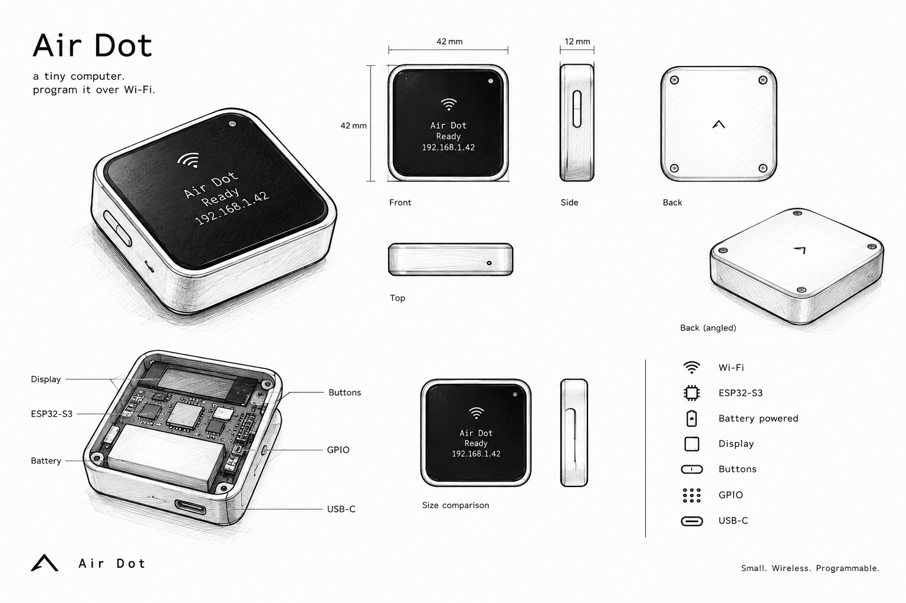

# ESP Air

ESP Air is the firmware that runs for **Air Dot** and provides the wireless programming experience.

> Air Dot - Air Dot is a tiny, wireless programmable computer.

<picture>
  <source media="(prefers-color-scheme: light)" srcset="designs/airdot-tbg.png">
  
  
Air Dot

</picture>

No OS.
No cloud.
No cable.

